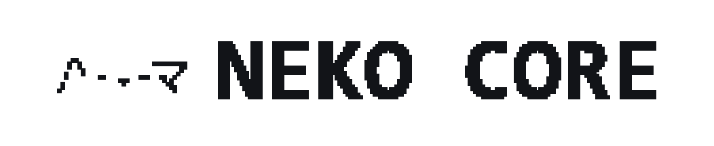

# Neko Core

> **Một chú mèo trong terminal — chỉ muốn meo meo, và làm việc.** A **local-first, extensible terminal
> agent** that codes, browses, remembers — and through **skills, MCP, and an evolving memory** grows into
> new roles, from sourcing goods to driving a browser. Built on **TypeScript + Bun + Ink**,
> **provider-agnostic**, **offline-capable**.

**By [The Wiii Lab](https://github.com/meiiie).** MIT-licensed — contributions welcome.

[](https://github.com/meiiie/neko-core/actions/workflows/ci.yml)
[](https://github.com/meiiie/neko-core/releases)
[](LICENSE)
[](https://bun.sh)

---

## What it is

Neko is a general-purpose agent that **acts on your machine** from the terminal — it reads, searches,
edits, and runs code, drives a browser, and reaches the web. It is **config-first** (model / provider /
policy live in config, not code) and **not locked to any single role**: coding is what it does out of the
box, but its **pluggable skills**, **MCP tools**, and **memory** extend it into whole new domains. It
talks to **any OpenAI-compatible endpoint** — a hosted API (NVIDIA NIM, OpenAI, …) or a **local server**
(llama.cpp `llama-server`, Ollama), so it works offline.

### The foundation

- **Streaming agent loop** — `complete → tool-calls → observe`, capped by `max_steps`, with live token
  streaming, read-only tool fan-out (parallel), a stuck-loop guard, and auto-compaction. Token UX separates
  the cumulative multi-call turn/session from the last request's actual context; multimodal estimates count
  decoded images rather than their base64 transport bytes. Stable prompt prefixes and provider cache affinity
  reduce repeated prefill; the evolving playbook sends a compact index and retrieves full lessons on demand.
  Experimental `adaptive_effort: true` (or `NEKO_ADAPTIVE_EFFORT=1`) lowers the completion after a
  productive mechanical read. Leave it off for general-purpose work: unlike a learned history-aware router,
  this lagged heuristic can mistake the hardest post-read synthesis for an easy step. Enable it only after a
  representative repeated eval shows no quality regression for your retrieval-heavy workload.
- **Tools** — `read_file` · `search` · `glob` · `ls` (safe) and `write_file` · `edit` · `multi_edit` ·
  `bash` · `computer` (approval-gated). `search` uses ripgrep when present; `bash` takes a per-call timeout
  and can run in the background; `read_file` pages large files and reads images/PDFs. On Windows,
  `computer` combines UI Automation, mouse-independent touch, Unicode typing, shortcuts, scrolling, and
  app/file/URL launch. With vision enabled, a desktop screenshot returns directly to the model as the
  next observation; text-only drivers can pass the saved capture to a separate vision model. Path-escape
  is refused.
- **Web, a ladder not a cliff** — `web_search` + `web_fetch` work with zero config (DuckDuckGo).
  `neko setup web` upgrades to a private multi-engine SearXNG that Neko wakes on demand and stops when
  idle (Docker, Ollama-style); `neko setup tavily <key>` wires hosted agent-search with no Docker at
  all. Its real-browser path uses a persistent Chrome profile by default (sign in once); choose
  `neko setup browser attach` for existing Chrome tabs or `isolated` for disposable tests. Each rung
  falls back to the next automatically. See
  [`docs/process/WEB.md`](docs/process/WEB.md).
- **Explicit-tab browser bridge** — ask Neko to browse a signed-in site and it offers setup at the point of
  need; `/browser` opens the same flow directly. Neko prepares the extension files, opens the
  supported Chrome install surface, and starts the authenticated loopback bridge. Until the public Store item
  ships, Chrome still requires one explicit **Load unpacked** confirmation; local files alone are never reported
  as installed or connected. `neko browser install` remains
  the non-TUI diagnostic/fallback; users never need a Bun or source-tree command after the one-line installer.
  After setup, normal `neko` sessions start the bridge automatically. Its autonomous-attach switch lets the
  authenticated local Neko session select the active http(s) tab without another click; users can disable it
  and attach manually. Read/click/type grants are separate, sensitive fields stay blocked, and
  emergency stop detaches immediately; an `AI` badge, page marker, and non-destructive tab group make control
  visible. No cookie or capability is sent through `/relay`. The public-release bundle, privacy policy, and
  Chrome Web Store submission checklist live in [`browser-extension/`](browser-extension/).
- **Verified Office artifacts** — Word, Excel, and PowerPoint use a typed optional adapter rather than GUI
  coordinate scripts or arbitrary shell strings. Read/help/validate calls are safe; create/edit/render calls
  remain approval-gated. An edit is staged, applied as one stop-on-error batch, closed, validated, and only
  then atomically moved into place. Same-file edits require the SHA-256 returned by a fresh inspection.
  Completion still requires targeted readback and visual evidence because valid OOXML does not prove correct
  layout or current Excel calculations. Install or remove the optional engine from `/support office`; Neko
  never downloads it silently. See [`docs/process/OFFICE.md`](docs/process/OFFICE.md).
- **Local meeting companion** — `/meeting` opens a consent-first capture surface for audio already playing on
  this computer plus an optional separate microphone channel. Audio streams to a local stereo WAV; video is
  never read or stored. A verified optional whisper.cpp pack transcribes Vietnamese locally, and the
  `meeting-notes` skill produces decisions/actions only with timestamp evidence. It works with meeting products
  through the browser/OS audio source rather than pretending to be a bot that can silently join every service.
  See [`docs/process/MEETINGS.md`](docs/process/MEETINGS.md).
- **Permission modes** — `default` / `accept-edits` / `plan` / `auto`, cycled with **Shift+Tab** (a
  *named* bounded-autonomy state, audited by `neko policy`); a seatbelt blocks catastrophic shell.
- **Fullscreen terminal UI** — an app-owned, flicker-free viewport (alt-screen, like vim/htop):
  markdown renders live *as it streams*, scrolling is hardware-smooth at your display's refresh rate
  (auto-detected; `/fps`), the mouse wheel scrolls, drag selects + copies (or `Ctrl+C` / `/copy`),
  clicking in the input moves the caret, clicking an option in an approval box or picker selects it,
  `Alt+C` copies the current draft without clearing it, `Ctrl+F` finds in the transcript, and the
  tab title tracks your session (a pulsing dot while it works). Multi-line prompts: `Shift+Enter` /
  `Ctrl+Enter` on terminals with the kitty keyboard protocol (auto-negotiated), `\` + `Enter`
  everywhere else, or run `neko setup terminal` to add a Windows Terminal keybinding — plain Enter
  submits. Exit leaves your shell exactly as it was — plus a one-line resume hint.
- **Sessions** — conversations persist; resume with `neko --resume`.
- **MCP** — connect Model Context Protocol servers (stdio / http / sse + OAuth) and use their tools;
  lazy schema loading keeps a big MCP surface out of context until needed.

### Extensible by design — not just a coding tool

Neko is built to take on new roles, one skill and one tool at a time:

- **Skills** — pluggable domain expertise with progressive disclosure. One is a *purchasing officer*
  (research, source, and plan a purchase across Vietnamese retailers — humans approve and buy); another
  creates or edits Word, Excel, and PowerPoint artifacts through an optional structured backend, then reopens,
  validates, reads back, and visually checks the saved file. Browser and computer-use skills likewise verify
  real UI state frame by frame. A skill is a markdown file, not a fork; built-in skills and their helper
  scripts ship inside the single binary. The meeting skill pages long transcripts from disk and requires cited
  decisions/action items instead of putting an entire recording into model context.
- **Governable memory** — raw episodes stay in local sessions; durable facts use JIT-recalled `memory`;
  verified procedures use `workflows`; and an evidence-grounded `playbook` captures operating lessons.
  Two bounded core profiles keep only recent `user.md` and `self.md` observations in active context.
  `/memory` shows the whole layout; `/memory off` stops recall and updates without deleting anything;
  `list`, `read`, and `forget` keep the user in control.
  Neko's identity is local-first too: the first agent session creates `~/.neko-core/NEKO.md` once with
  Neko Core's compact origin story, character, values, and truth boundary. It is never overwritten and
  cannot weaken tool permissions. Project `NEKO.md` files remain separate project instructions.
- **Remote control from any device** — type `/relay`, scan the QR, and drive Neko from your phone
  anywhere; the agent **dials out** (no open port) over an **end-to-end-encrypted** relay you host.
- **Auto-update** — Neko keeps itself current like Claude Code: a daily startup check installs new
  releases in the background (they apply on the next launch). `auto_update: false` switches to
  notify-only; `neko update` still works manually.

The direction is open-ended: an agent that can do more of your computer's work over time. The extension
model is documented in [`docs/EXTENDING.md`](docs/EXTENDING.md).

## Install

**One line — no Bun required.** Downloads a standalone binary from the latest
[release](https://github.com/meiiie/neko-core/releases):

```bash
# macOS / Linux
curl -fsSL https://neko.holilihu.online/install.sh | sh
```

```powershell
# Windows (PowerShell)
irm https://neko.holilihu.online/install.ps1 | iex
```

> Fallback if the domain is unreachable: swap the URL for
> `https://raw.githubusercontent.com/meiiie/neko-core/main/install.sh` (and `…/install.ps1`).

**Current release: [v0.15.2](https://github.com/meiiie/neko-core/releases/tag/v0.15.2).**
Every release passes the full gate battery before it is tagged — tests, render + input smokes, a
real-ConPTY e2e, scroll bench, secret scan (`docs/process/RELEASE.md`). **Pin or roll back any time**
(the pin holds — auto-update won't undo it): `neko update 0.9.0`, or at install time
`... | sh -s -- --version 0.9.0` (unix) / `& ([scriptblock]::Create((irm .../install.ps1))) -Version 0.9.0` (Windows).

Then start Neko and use the guided sign-in:

```bash
neko
# /login -> OpenAI -> ChatGPT Plus/Pro  (subscription, no API billing)
#                  -> API key          (pay-as-you-go API)
#        -> Google -> Gemini API key    (official free tier / optional paid; recommended)
#                  -> Code Assist Standard/Enterprise (OAuth)
#        -> Anthropic -> Claude Sonnet 5 / Fable 5 API key
#        -> xAI       -> Grok 4.5 / Grok Build API key
#        -> Kimi      -> Kimi Code account (OAuth) / Kimi Platform API key
#        -> DeepSeek  -> DeepSeek V4 API key
```

Browser control and meeting capture are optional and progressively disclosed. The first Neko session mentions browser control, and a natural
request such as "browse Facebook in Chrome" opens a setup choice while keeping the request intact; `/browser`
opens the same flow directly. Use it only when you want Neko to control one visible, already signed-in Chrome
tab. Autonomous attach is enabled by default and independently switchable in the extension. Chrome still shows
its required extension-permission confirmation. There is no second `bun bin/neko.ts ...` install step.

For a meeting, use `/meeting` inside Neko. Its guided surface can install local Vietnamese transcription and
start in one choice, or record immediately and transcribe later. The standalone equivalent is
`neko meeting start "Weekly sync"`; see the [meeting guide](docs/process/MEETINGS.md).

The equivalent non-TUI commands are:

```bash
neko login openai chatgpt
neko login openai api <key>
neko login google gemini
neko login google api <key>
neko login kimi
neko login kimi api <key>
neko login deepseek <key>

# Headless/SSH alternative: prints a URL and one-time device code
neko login openai chatgpt --device

neko doctor
```

Anthropic and xAI are direct, official API-key routes (not subscription/OAuth proxies). For a non-TUI
session, set `ANTHROPIC_API_KEY` and run `neko --profile claude`, or set `XAI_API_KEY` and run
`neko --profile xai` (current Grok 4.5) / `neko --profile grok-build` (the dedicated coding model).
`/model` can switch among the models exposed by the selected route.

Kimi is also first-class and connects directly to Moonshot AI. `neko login kimi` uses Moonshot AI's public
RFC 8628 device flow and stores Neko's own refreshable session in `~/.neko-core/kimi-auth.json`; it never
reads another CLI's credentials. `neko login kimi api <key>` is a separate Kimi Platform route, using
`KIMI_API_KEY` (the older `MOONSHOT_API_KEY` name remains compatible). The account route reads the live
model/capability catalog after sign-in. DeepSeek remains an official API-key route because DeepSeek does
not publish an account OAuth contract: `DEEPSEEK_API_KEY` selects current `deepseek-v4-pro` by default,
with V4 Flash in `/model`, 1M context metadata, thinking controls, and tool-turn `reasoning_content`
continuation. Neither route starts a local proxy or sends cookies to Neko.

The ChatGPT profile uses the Codex Responses backend and never falls back to an OpenAI API key. Usage
is governed by the limits and model access of your ChatGPT plan; it does not create API pay-as-you-go
charges. Credentials are refreshed automatically and stored separately in
`~/.neko-core/chatgpt-auth.json` (restricted file permissions where the OS supports them). This
third-party integration may need an update if OpenAI changes its OAuth flow or Codex backend.
`/model` reads the live account-aware Codex catalog. GPT-5.5 and other compatible models keep using Neko's
lightweight direct transport. GPT-5.6 Sol/Terra/Luna use the official local
[Codex App Server](https://developers.openai.com/codex/app-server) protocol
because their Responses-Lite/code-mode route rejects honest third-party HTTP clients. Neko first reuses a
compatible Codex CLI already installed on the machine; the optional GPT-5.6 Support Pack is the standalone
fallback and is not required for GPT-5.5, API-key providers, Ollama, or other local models. App Server runs
hidden, on demand, with an isolated Codex home; Neko's existing OAuth token and approval-gated ToolRegistry
remain authoritative, so there is no second sign-in and no client-identity spoofing. It stops after 15 idle
minutes by default (`codex_keepalive`; `0` keeps it alive until logout/exit). Model metadata also drives
native image input, context size, and `/effort`, so each usable model shows only its supported reasoning
tiers. `/usage` reads the subscription's short/weekly quota windows, reset times, extra model buckets, and
credits without making a model request. `/logout` signs out only the active route, so ChatGPT OAuth and
OpenAI API keys do not erase each other.

`/voice` first offers **Neko Conversational Voice - Browser Preview**. It opens a capability-authenticated
`127.0.0.1` page and keeps the microphone off until **Start** is pressed. Browser speech recognition produces
interim/final text; final text runs through the normal Neko Agent, provider, tools, and approval boundary, and
the reply returns through browser speech synthesis. A local interaction policy can give a restrained `ừm` or
`mình đang nghe`, enforces one response per turn plus an eight-second cooldown, and stays silent around
passwords, tokens, URLs, long numbers, and questions. Speaking over a reply cancels both playback and the
active Agent turn before the next utterance is queued. This is an interruptible cascaded voice experience,
not a claim of native GPT-Live full duplex.

The preview adds no model download, but the browser may use its own online recognition/synthesis service.
That warning is shown before consent; Neko receives transcript text rather than microphone audio, and it
never silently selects a paid Realtime API. Chrome or Edge currently provide the expected Speech Recognition
surface; unsupported browsers fail visibly and can use OS Dictation instead.

**Open ChatGPT** opens `chatgpt.com`; Voice appears only when the user's account/browser rollout provides it.
That tab runs separately and Neko never reads its cookies, microphone, transcript, or session. The third
**Neko Subscription Bridge - Lab** option uses the official Codex App Server experimental surface.
Neko opens a small `127.0.0.1` page in the default browser because a terminal has no native WebRTC or
microphone permission UI. The microphone remains off until the user presses **Start voice** in that page;
the OAuth token never enters the page, and subscription-only App Server processes have API-key environment
variables removed. While connected, the TUI shows `● LIVE`, elapsed time, mute state, and the live transcript.
Use `/voice mute`, `/voice unmute`, `/voice status`, or `/voice stop`; closing the tab, logging out, managing
the support component, or exiting Neko also releases the microphone and closes realtime. Voice tool calls
return through the same Neko approval/sandbox boundary as text turns. Neko never silently falls back to the
paid Realtime API. If account/region rollout is unavailable it suggests OS dictation (Windows: `Win+H`;
the operating system's data policy applies) and reports the backend error honestly. OpenAI does not currently
expose remaining Voice quota through this
experimental Codex surface, so `/usage` shows session duration and the last limit/error instead of inventing
a remaining percentage. The existing GPT-5.6 Support Pack already contains this protocol; voice adds no second
download. On 2026-07-24, the owner's real ChatGPT account completed the WebRTC handshake and reached `LIVE`
on negotiated Realtime V3 with Codex App Server 0.145.0. This remains a Lab integration over an experimental
App Server surface: account rollout and workspace settings still apply, and it is not the public Realtime API.

When `/model` needs the component, Neko asks before downloading anything. You can also manage it directly:

```bash
neko support status           # reuses an installed Codex CLI when compatible
neko setup codex              # install the optional standalone App Server
neko support update           # verify and replace with the latest stable official release
neko support remove           # remove only Neko's managed pack, never the user's Codex CLI
```

Inside the TUI, bare `/support` opens the Support Center: it shows all optional components, who owns
each installation, and the exact managed disk usage. Selecting a Neko-managed component offers
Update/Repair and Remove. Removal has a safe confirmation screen and lets the user either preserve the
subscription sign-in or remove the component and sign out. If Neko is reusing a CLI the user installed,
the screen says so and deliberately offers no fake Remove action; Neko never uninstalls software it does
not own. `/support status` remains a copyable text report for diagnostics.

On Windows x64, the tested OpenAI `0.144.1` standalone archive is 92.7 MiB and occupies 270.4 MiB after
installation. It is downloaded from the official `openai/codex` GitHub release, checked against the asset's
published SHA-256, and required to have a valid OpenAI Authenticode signature before Neko activates it.
The base Neko install is unchanged because the pack remains opt-in.

Office artifact support follows the same owner-aware pattern without becoming a model/provider dependency:

```bash
neko support office status
neko support office install   # explicit opt-in, no administrator access
neko support office update
neko support office remove    # removes only Neko's managed binary, never your documents/PATH install
```

Neko downloads the single Apache-2.0 OfficeCLI binary from the official `iOfficeAI/OfficeCLI` GitHub release,
requires GitHub's published asset SHA-256, checks the platform executable and a real create/validate probe,
then installs atomically under `~/.neko-core/office-support`. The tested Windows x64 v1.0.136 binary is
31.6 MiB. Neko disables OfficeCLI self-update, auto-install, and implicit resident mode so the recorded digest,
process lifecycle, and on-disk verification remain authoritative; the managed digest is checked again before
the first Office tool execution in each Neko process. Existing PATH installs are reused but clearly labelled as
user-owned and are never removed by Neko.

If LibreOffice is already installed, Neko also discovers `soffice` and can cross-render DOCX/XLSX/PPTX to a
whole-file PDF. Every export uses a new private LibreOffice profile and an on-disk snapshot, so it neither reads
the user's LibreOffice profile nor joins a running desktop instance. This is independent evidence, not a
replacement for typed editing and not an OS sandbox. Neko does not silently download the roughly 350 MiB suite;
`/support office status` reports both engines and their distinct roles.

Meeting transcription follows the same owner-aware pattern:

```bash
neko support meeting install          # balanced multilingual model (Vietnamese supported)
neko support meeting install quick    # smaller/faster model
neko meeting start "Weekly sync"
neko meeting eval ./my-reference-cases.json
```

The pack uses verified official whisper.cpp release/model artifacts and installs under
`~/.neko-core/meeting-support`; recordings remain separately under `~/.neko-core/meetings`. Removing the pack
never deletes evidence. Neko does not claim person-level diarization from its two-channel mic/system capture or
claim SOTA ASR without a frozen corpus; the built-in evaluator reports WER, CER, RTF, and channel-source accuracy.

The recommended `gemini-api` profile connects directly to Google's documented
[OpenAI-compatible Gemini endpoint](https://ai.google.dev/gemini-api/docs/openai) with `GEMINI_API_KEY`.
There is no local proxy, bundled third-party service, or OAuth token reuse. Neko's existing adapter gets
streaming, function calling, vision, structured output, reasoning effort, and the live `/models` catalog;
Gemini-specific opaque tool metadata is replayed only to the same endpoint so multi-turn thinking remains
intact without leaking it after a provider switch. The stable default is `gemini-3.5-flash`; `/model` can
select any model the key is entitled to. Google offers a limited free tier and optional paid tiers.

The separate `gemini` profile is only for Code Assist Standard/Enterprise. It uses the official
[Gemini CLI](https://github.com/google-gemini/gemini-cli) over
[Agent Client Protocol (ACP)](https://github.com/google-gemini/gemini-cli/blob/main/docs/cli/acp-mode.md).
Google [ended Gemini CLI consumer OAuth](https://developers.google.com/gemini-code-assist/docs/deprecations/code-assist-individuals)
for Free, AI Pro, and AI Ultra on 18 June 2026 and moved those users to Antigravity. A Google AI Pro account
still receives its higher quota in [Antigravity](https://antigravity.google/docs/plans?app=cli), but that
subscription does not become Gemini API billing or quota. To use Neko with the same Google account, create a
separate restricted [Gemini API key](https://ai.google.dev/gemini-api/docs/api-key) in AI Studio; Neko then
uses that API project's free tier or separately enabled API billing. Neko does not read Antigravity's keyring,
reuse its token, imitate its client identity, or call its private endpoints.

Antigravity CLI 1.1.1 does publish a headless `agy -p` command, but it is a complete agent harness rather
than a model transport: it owns its own tools, permissions, conversations, and workspace access and does not
expose the structured completion/tool/continuation contract required by Neko's `Provider` port. Wrapping it
would create an agent-inside-an-agent and bypass Neko's approval and audit boundary. More importantly,
Google's [Antigravity terms](https://antigravity.google/terms) and
[FAQ](https://antigravity.google/docs/faq) explicitly prohibit using third-party software with Antigravity
OAuth and recommend Vertex or an AI Studio API key for third-party coding agents. Neko therefore does not
offer an Antigravity subscription profile, including for lab builds.

For Code Assist Standard/Enterprise only, Neko reuses a compatible installed Gemini CLI when available.
Otherwise `/login` offers one-step installation of a Neko-managed Support Pack: Google's official bundle
plus a private Node LTS runtime under `~/.neko-core/gemini-support`. It requires no administrator access,
global npm package, or PATH change and does not enlarge the base Neko download. Manage it with
`neko setup gemini` or `/support gemini install|update|remove`. The sidecar is persistent only for the Neko
session. Neko forces an isolated ACP configuration: Gemini built-in tools, extensions, and hooks are
disabled, and the only advertised MCP server is a random-token loopback proxy. Every read, edit, and command
therefore returns through Neko's existing ToolRegistry and approval gate. Gemini API-key users do not need
this Support Pack.

Enterprise OAuth state lives in Neko's own `~/.neko-core/gemini-home`, even when Neko reuses a system Gemini binary;
therefore `/logout` cannot sign the user's separate Gemini CLI session out. `/usage` reports token usage
returned by ACP. Google does not currently expose the remaining daily request count through ACP, so Neko
reports that limitation without opening another CLI or scraping a private endpoint.
See the official [authentication](https://github.com/google-gemini/gemini-cli/blob/main/docs/get-started/authentication.mdx)
and [quota](https://github.com/google-gemini/gemini-cli/blob/main/docs/resources/quota-and-pricing.md) docs.

For API-key or local-model providers:

```bash
neko init-user                 # scaffold user config + identity + bounded local memory
# edit ~/.neko-core/config.json: set api_key + model (or use env NEKO_API_KEY)
neko doctor                    # check provider/model/key
neko                           # start the interactive session  (also: neko core; legacy: neko code)
```

Keep it current with `neko update`.

### From source (development) — requires [Bun](https://bun.sh)

```bash
git clone https://github.com/meiiie/neko-core
cd neko-core
bun install
bun run build                  # -> dist/neko  (single standalone executable; no Bun to run it)
bun bin/neko.ts doctor         # or run directly via Bun, no build needed
```

### Commands

`neko` (session, default) · `run <task>` · `config` · `doctor` · `profiles` · `init[-user]` · `tools` ·
`agents` · `commands` · `capabilities` · `policy` · `context` · `sessions` · `mcp` · `login` · `logout` · `update`.

Bare `neko` (or `neko core`; legacy `neko code`) starts the interactive session.
`--profile <name>` selects a runtime profile · `--yolo` auto-approves gated tools ·
`neko --resume` continues the latest session.

## Contributing

Issues and PRs are very welcome — see **[CONTRIBUTING.md](CONTRIBUTING.md)**. In short: `bun install`,
make your change, then `bun run typecheck && bun test` must stay green (plus `neko policy` for the
safe/gated boundary). The architecture (Ports & Adapters) is in
[`docs/process/ARCHITECTURE.md`](docs/process/ARCHITECTURE.md); the roadmap and working notes are under
[`docs/process/`](docs/process/). A new model or endpoint is a config **profile**, not code.

## Heritage

Neko Core began as a config-first inference harness for **HackAIthon 2026 — Bảng C** (team Neko Core,
Vietnam Maritime University). The competition entry stays frozen at
[`meiiie/bang_c`](https://github.com/meiiie/bang_c). The original standalone port was written in Python
and is preserved as the **spec/reference** under [`reference/python/`](reference/python/); the shipping
product is this TypeScript build.

## Team

Team **Neko Core** — Vietnam Maritime University (VMU): Nguyễn Mạnh Hùng (lead) · Bùi Việt Hoàng · Phạm
Thị Minh Hồng · Phạm Thị Thu Thảo · Nghiêm Thị Mỹ Linh

## License

MIT © 2026 The Wiii Lab — see [LICENSE](LICENSE).
