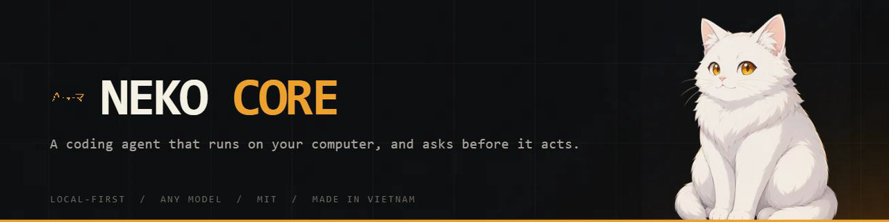

# Neko Core

> **Một chú mèo trong terminal — chỉ muốn meo meo, và làm việc.**

Neko Core is a local-first terminal agent for coding and computer work. It combines a provider-agnostic
agent loop, durable sessions, governed tools, skills, MCP, browser control, and an Ink terminal UI in one
standalone binary. The shipped CLI is written in TypeScript, compiled with Bun, and does not require Bun
on the user's machine.

**By [Meiiie / The Wiii Lab](https://github.com/meiiie).** Download in English or Vietnamese at
**[neko.holilihu.online](https://neko.holilihu.online)**.

[](https://github.com/meiiie/neko-core/actions/workflows/ci.yml)
[](https://github.com/meiiie/neko-core/releases)
[](LICENSING.md)
[](https://bun.sh)

**Stable 1.x line.** Public CLI, configuration, durable-session, SDK, ACP, authority, and rollback contracts
follow the [stability and support policy](docs/process/STABILITY.md). See the
[current release](https://github.com/meiiie/neko-core/releases/latest) for install and upgrade notes.

## Why Neko

- **A real agent harness.** Streaming `complete -> tool calls -> observe` loop, concurrent safe reads,
  context relief, compaction, loop recovery, verification debt, and bounded closed-loop continuation.
- **Local-first and provider-agnostic.** Use hosted APIs, supported subscription accounts, or an
  OpenAI-compatible local server. Models and endpoints are config, not product forks.
- **Governed action.** Read tools are safe; edits, shell, browser, Office, and host-computer actions pass
  through one permission boundary. Catastrophic commands and credential targets remain hard refusals.
- **Durable work.** Sessions checkpoint messages, tool calls, results, provider continuation data, model,
  profile, and mode. Resume after an interrupt or process restart without silently replaying mutations.
- **Terminal-native UX.** Fullscreen transcript, live Markdown, smooth scrolling, mouse selection, clickable
  pickers, multiline input, image paste, completion alerts, and clean terminal restoration on exit.
- **Extensible everywhere.** Built-in skills ship inside the binary and work from every folder;
  `~/.neko-core/skills` adds global overrides. MCP, recipes, memory, workflows, and ACP extend the same core.
- **Auditable delivery.** Every release is built for five targets, smoke-tested, checksummed, and published
  by GitHub Actions. Exact-version rollback is supported by both the updater and installers.

## Install

One line; no Bun or Node.js required:

```bash
# macOS / Linux
curl -fsSL https://neko.holilihu.online/install.sh | sh
```

```powershell
# Windows PowerShell
irm https://neko.holilihu.online/install.ps1 | iex
```

If the domain is unavailable, use the same scripts from
`https://raw.githubusercontent.com/meiiie/neko-core/main/install.sh` or `install.ps1`.
Direct binaries and their SHA-256 files are on the
[latest release](https://github.com/meiiie/neko-core/releases/latest).

Start Neko:

```bash
neko
```

Then use `/login`, choose a provider and an authentication route, and use `/model` to select from the
catalog available to that account. `neko doctor` performs read-only setup diagnostics.

## Provider routes

Neko keeps account subscriptions and pay-as-you-go API billing visibly separate.

| Provider | Supported route |
|---|---|
| OpenAI | ChatGPT subscription OAuth or OpenAI API key |
| Google | Gemini API key or Code Assist Standard/Enterprise OAuth through isolated ACP |
| Anthropic | Anthropic API key |
| xAI | Grok subscription OAuth or xAI API key |
| Kimi | Kimi Code account OAuth or Kimi Platform API key |
| DeepSeek | DeepSeek API key |
| Z.AI | GLM Coding Plan or paid General API |
| OpenRouter | API key with live tool-capable model discovery |
| OpenCode | Console account OAuth or Zen service-account API key |
| Cline | Cline Account device OAuth or Cline API key |
| Local/custom | Any configured OpenAI-compatible endpoint, including llama.cpp or Ollama |

Neko owns and refreshes its own OAuth state. It does not import another CLI's credential store, mix an
account token with API billing, or silently fall back across authentication routes. Credentials are stored
outside the transcript and removed from child-process environments.

Non-interactive examples:

```bash
neko login openai chatgpt
neko login openai api <key>
neko login google api <key>
neko login xai
neko login xai api <key>
neko login kimi
neko login deepseek <key>
neko login openrouter <key>
neko login opencode
neko login opencode zen <key>
neko login cline account
neko login cline api <key>
```

## Everyday use

```bash
neko                         # interactive TUI
neko --yolo                  # no approval waits; hard seatbelts still apply
neko --resume                # resume the latest session in this folder
neko run "fix the failing tests"
neko run --loop "finish the migration and verify it"
neko acp                     # ACP v1 server for Zed, JetBrains, and other clients
neko acp --host-profile nekocut # exclusive six-tool embedding profile for NekoCut
neko update                  # install latest and resume auto-updates
neko update <version>        # exact rollback/pin; pauses auto-updates
```

Inside the TUI:

- `Shift+Tab` cycles `default`, `accept-edits`, `plan`, and `auto`.
- `Esc` interrupts the active turn; `Ctrl+C` clears a draft, then exits on the second press.
- `Alt+V` pastes an image; `Alt+C` copies the full draft; `Ctrl+O` expands tool output.
- `/model`, `/login`, `/resume`, `/memory`, `/browser`, `/meeting`, `/support`, and `/help` expose the
  corresponding guided surfaces.

Neko plays its short Bubble completion sound after successful background work. Set
`completion_sound:false` in `~/.neko-core/config.json` or `NEKO_COMPLETION_SOUND=0` for silence.

## Permissions and sandboxing

The default `auto` mode is bounded autonomy: ordinary workspace work proceeds, while consequential host
boundaries remain explicit. `--yolo` grants those prompts for the current launch, but does not disable project
trust, credential/system path protection, catastrophic-shell refusal, or validation.

Shell commands use a platform sandbox when a healthy primitive is available. The filesystem is confined to
the workspace plus exact configured roots, and network access is denied by default or granted to exact domains.
If a configured sandbox is unhealthy, Neko fails closed instead of pretending a host command was isolated.
Run `neko policy` to inspect the effective boundary. See [Sandbox](docs/process/SANDBOX.md) and
[Architecture](docs/process/ARCHITECTURE.md).

## Browser, Office, meetings, and remote control

- `/browser` connects a capability-scoped loopback bridge to an explicitly visible Chrome tab. Signed-in
  browser state remains local; relay clients never receive cookies or browser capabilities.
- `/support office` installs the optional checksummed Office engine. Typed operations stage, validate, and
  atomically publish Word, Excel, and PowerPoint changes.
- `/meeting` records consented local audio, keeps video out, and can install a verified local transcription
  pack. Notes require timestamp evidence.
- `/relay` pairs a phone through an outbound, end-to-end-encrypted session without opening a local port.

These surfaces are optional and progressively disclosed. Their contracts live under
[docs/process](docs/README.md#capability-guides).

## ACP

`neko acp` exposes the same agent, tools, permissions, skills, and durable session store over ACP v1.
Clients can create, list, load, resume, and close sessions; replay and resume are deliberately distinct.
Permission requests map to Neko's named modes rather than bypassing the CLI safety boundary. See
[Neko over ACP](docs/process/ACP.md).

Embedding applications can opt into a launch-authorized host profile. The first profile,
`neko acp --host-profile nekocut`, disables native/global tools and accepts only NekoCut's exact
MCP-over-ACP surface for that session. Ordinary ACP behavior is unchanged, and an ACP request cannot select
or widen the profile after launch.

## Configuration

Configuration overlays, lowest to highest precedence:

```text
built-ins < profile preset < ~/.neko-core/config.json < ./.neko-core/config.json < NEKO_* environment
```

Use `neko config`, `neko profiles`, `neko doctor`, and `neko policy` to inspect the resolved state.
Provider keys may come from their named environment variables or the gitignored user config. A new model or
endpoint belongs in a profile; it should not require changing the agent core.

## Develop from source

Development requires Node.js and the stable Bun version pinned by CI:

```bash
git clone https://github.com/meiiie/neko-core
cd neko-core
bun install --frozen-lockfile
bun run typecheck
bun test
bun run build
```

The compiled `dist/neko` is the primary runtime. `node bin/neko-source.cjs` is the safe development launcher;
it disables project autoload before Bun starts. Do not invoke the internal TypeScript entry directly from an
untrusted folder.

The package root is also a side-effect-free Bun/TypeScript library. Hosts inject their own provider and
approval gate:

```ts
import { Agent, ToolRegistry, type ApprovalGate, type Provider } from "neko-core";

export function createAgent(provider: Provider, root: string, approve: ApprovalGate) {
  const tools = new ToolRegistry(root, "default", approve);
  return new Agent({ provider, tools });
}
```

Start with the [documentation index](docs/README.md), then read the
[harness architecture](docs/HARNESS-ARCHITECTURE.md), [working rules](docs/process/RULES.md), and
[testing contract](docs/process/TESTING.md). The public compatibility commitment is in the
[stability policy](docs/process/STABILITY.md). Contributions are described in [CONTRIBUTING.md](CONTRIBUTING.md).

## Heritage and ownership

Neko Core began with the frozen HackAIthon 2026 Bảng C project at
[`meiiie/bang_c`](https://github.com/meiiie/bang_c). That repository is historical input, not a runtime
dependency. The original Python port is retained under [`reference/python`](reference/python/) as a spec;
the shipping product is the TypeScript implementation.

The owner and publisher of Neko Core is **Meiiie / The Wiii Lab**.

## License

The core and CLI are **AGPL-3.0-only** or available under a separate commercial agreement. Independently
implemented code under `sdk/` is **Apache-2.0**. The Neko Core name and branding are proprietary and are not
granted by either code license. See [LICENSING.md](LICENSING.md),
[COMMERCIAL-LICENSE.md](COMMERCIAL-LICENSE.md), and [TRADEMARKS.md](TRADEMARKS.md).
